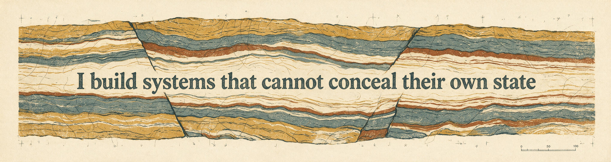
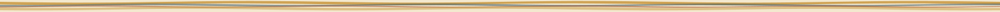
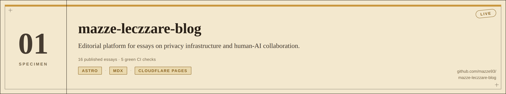
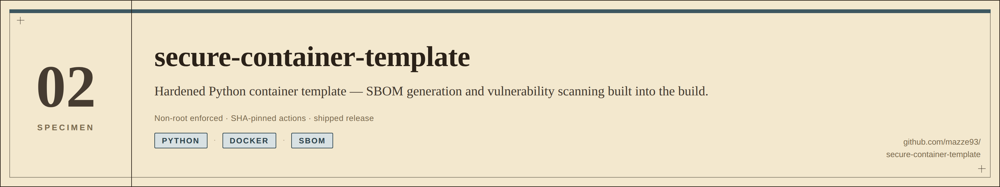
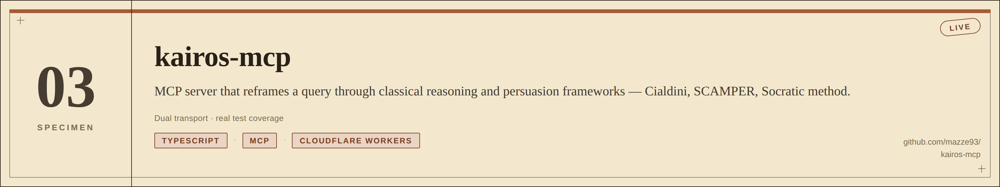
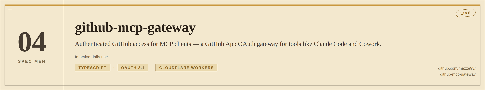
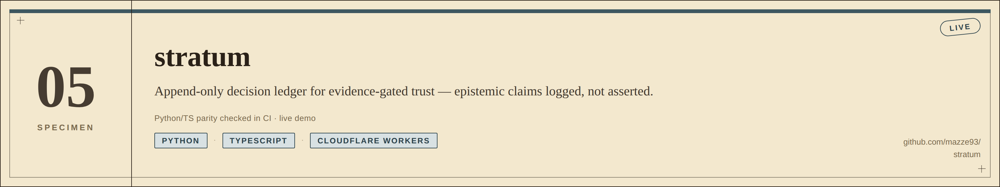
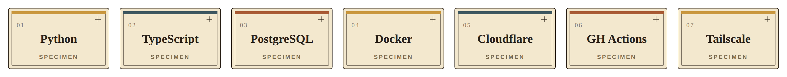

  <picture>
    <source media="(prefers-color-scheme: dark)" srcset="./assets/banner-dark.png">
    <source media="(prefers-color-scheme: light)" srcset="./assets/banner-light.png">
    
  </picture>

  <strong>Security engineering, open infrastructure, and AI evaluation for systems that should fail visibly, not silently.</strong>

  <a href="https://mazzeleczzare.com">mazzeleczzare.com</a> &nbsp;·&nbsp;
  <a href="https://orcid.org/0009-0005-9661-4780">ORCID</a> &nbsp;·&nbsp;
  <a href="mailto:mazze@mazzeleczzare.com">Get in touch</a>

  <picture>
    <source media="(prefers-color-scheme: dark)" srcset="./assets/divider-dark.svg">
    <source media="(prefers-color-scheme: light)" srcset="./assets/divider-light.svg">
    
  </picture>

## Thesis

Systems reveal themselves under pressure — that's the working premise behind everything in this profile. I build and test for **observable state**: security tooling, privacy-preserving infrastructure, and human-AI systems designed so that failure surfaces early instead of getting buried under a passing test suite.

Every project here is built against the same constraint: it has to work, be auditable, and be legible to people who aren't security engineers.

  <picture>
    <source media="(prefers-color-scheme: dark)" srcset="./assets/divider-dark.svg">
    <source media="(prefers-color-scheme: light)" srcset="./assets/divider-light.svg">
    
  </picture>

## Current Excavations

- Hardening privacy-first, local-first infrastructure (Meridian, mindful-dev)
- Building policy guardrails and integrity telemetry for agentic AI (praxis-aegis, stele)
- Extending forensic tooling and MCP-server infrastructure (git-forensics-agent, kairos-mcp)
- Writing on privacy infrastructure and human–AI collaboration

  <picture>
    <source media="(prefers-color-scheme: dark)" srcset="./assets/divider-dark.svg">
    <source media="(prefers-color-scheme: light)" srcset="./assets/divider-light.svg">
    
  </picture>

## Work Strata

| Domain | Focus | Typical output |
|---|---|---|
| Security & privacy infrastructure | Threat-informed hardening, container/CI security, adversarial-conditions design | tooling, templates, audits |
| Trustworthy & agentic AI | Policy guardrails, integrity telemetry, epistemic decision logging | guardrail libraries, ledgers, research notes |
| Apps & product design | Local-first sync, E2E-encrypted social systems, editorial platforms | shipped apps, calm UX under real constraints |

  <picture>
    <source media="(prefers-color-scheme: dark)" srcset="./assets/divider-dark.svg">
    <source media="(prefers-color-scheme: light)" srcset="./assets/divider-light.svg">
    
  </picture>

## Bedrock

The load-bearing layer — the sites where the evidence checks out cleanly against the claims. Not a "best of," a "checked."

  <a href="https://github.com/mazze93/mazze-leczzare-blog">
    <picture>
      <source media="(prefers-color-scheme: dark)" srcset="./assets/card-dark-01-mazze-leczzare-blog.png">
      <source media="(prefers-color-scheme: light)" srcset="./assets/card-light-01-mazze-leczzare-blog.png">
      
    </picture>
  </a>

  <a href="https://github.com/mazze93/secure-container-template">
    <picture>
      <source media="(prefers-color-scheme: dark)" srcset="./assets/card-dark-02-secure-container-template.png">
      <source media="(prefers-color-scheme: light)" srcset="./assets/card-light-02-secure-container-template.png">
      
    </picture>
  </a>

  <a href="https://github.com/mazze93/kairos-mcp">
    <picture>
      <source media="(prefers-color-scheme: dark)" srcset="./assets/card-dark-03-kairos-mcp.png">
      <source media="(prefers-color-scheme: light)" srcset="./assets/card-light-03-kairos-mcp.png">
      
    </picture>
  </a>

  <a href="https://github.com/mazze93/github-mcp-gateway">
    <picture>
      <source media="(prefers-color-scheme: dark)" srcset="./assets/card-dark-04-github-mcp-gateway.png">
      <source media="(prefers-color-scheme: light)" srcset="./assets/card-light-04-github-mcp-gateway.png">
      
    </picture>
  </a>

  <a href="https://github.com/mazze93/stratum">
    <picture>
      <source media="(prefers-color-scheme: dark)" srcset="./assets/card-dark-05-stratum.png">
      <source media="(prefers-color-scheme: light)" srcset="./assets/card-light-05-stratum.png">
      
    </picture>
  </a>

  <picture>
    <source media="(prefers-color-scheme: dark)" srcset="./assets/divider-dark.svg">
    <source media="(prefers-color-scheme: light)" srcset="./assets/divider-light.svg">
    
  </picture>

## Findings

Evidence that doesn't run through my own repos. Two denial-of-service vulnerabilities found and reported in js-yaml's merge-key handling, plus a credited analysis contribution to a related disclosure — verified via GitHub Security Advisories, not self-reported.

| CVE | Severity | Finding |
|---|---|---|
| [CVE-2026-59869](https://github.com/advisories/GHSA-52cp-r559-cp3m) | High (7.5) | Quadratic CPU consumption via chained merge keys — js-yaml 3.x/4.x |
| [CVE-2026-59868](https://github.com/advisories/GHSA-g796-fgmg-93mv) | Moderate (5.3) | Quadratic CPU consumption via merge-key chains — js-yaml 5.x |
| [CVE-2026-53550](https://github.com/advisories/GHSA-h67p-54hq-rp68) | Moderate (5.3) | Repeated-alias merge-key DoS — credited as an analyst alongside five other researchers |

  <picture>
    <source media="(prefers-color-scheme: dark)" srcset="./assets/divider-dark.svg">
    <source media="(prefers-color-scheme: light)" srcset="./assets/divider-light.svg">
    
  </picture>

## Selected Sites

Three exposures, drilled from the same face. Expand a core sample to see what's in it.

<strong>Security & privacy infrastructure</strong>

 

| Project | What it does |
|---|---|
| [**secure-pride**](https://github.com/mazze93/secure-pride) | Privacy-first cybersecurity tools and standards for LGBTQ+ communities and high-risk groups, built for adversarial conditions |
| [**git-forensics-agent**](https://github.com/mazze93/git-forensics-agent) | Zero-knowledge forensic case-file agent for adversarial git incidents — Durable Object brain, AES-256-GCM, HMAC-signed repair gate |
| [**mindful-dev**](https://github.com/mazze93/mindful-dev) | Claude Code pre-action safety gate — blocks dangerous commands, redacts secrets, guards shell access |

<strong>Trustworthy AI & agentic systems</strong>

 

| Project | What it does | Live |
|---|---|---|
| [**praxis-aegis**](https://github.com/mazze93/praxis-aegis) | Trust-layer for agentic AI: policy guardrails and signing-aware controls for AI tool use | — |
| [**stele**](https://github.com/mazze93/stele) | Directive compiler and integrity telemetry — governance-as-code for AI-assisted work | [stele.mazzeleczzare.com](https://stele.mazzeleczzare.com) |
| [**context-synapse**](https://github.com/mazze93/context-synapse) | Experimental engine for modeling how humans and AI systems negotiate context | — |
| [**adaptive-response**](https://github.com/mazze93/adaptive-response) | Schema-driven AI response engine — Cloudflare Worker + Zod-validated typed output, deny-by-default CORS | — |

<strong>Apps & product design</strong>

 

| Project | What it does |
|---|---|
| [**meridian**](https://github.com/mazze93/meridian) | Privacy-first, local-first calendar for Apple platforms — Tailscale-only peer sync, no cloud |
| [**lockr**](https://github.com/mazze93/lockr) | Privacy-first dating and social app for the LGBTQ+ community — E2E encryption, safety-first design |
| [**daedalus-switch**](https://github.com/mazze93/daedalus-switch) | Identity & context switcher — one command switches VPN, terminal, browser, and filesystem context |

  <picture>
    <source media="(prefers-color-scheme: dark)" srcset="./assets/divider-dark.svg">
    <source media="(prefers-color-scheme: light)" srcset="./assets/divider-light.svg">
    
  </picture>

## Instrument Panel

  <picture>
    <source media="(prefers-color-scheme: dark)" srcset="./assets/badges-dark.png">
    <source media="(prefers-color-scheme: light)" srcset="./assets/badges-light.png">
    
  </picture>

The instruments that show up across these sites, not a full résumé of tools.

  <picture>
    <source media="(prefers-color-scheme: dark)" srcset="./assets/divider-dark.svg">
    <source media="(prefers-color-scheme: light)" srcset="./assets/divider-light.svg">
    
  </picture>

## Research Line

Essays, technical notes, and research on privacy infrastructure, human–AI collaboration, and open-source systems thinking.

→ [mazzeleczzare.com](https://mazzeleczzare.com) &nbsp;·&nbsp; [ORCID 0009-0005-9661-4780](https://orcid.org/0009-0005-9661-4780)

  <picture>
    <source media="(prefers-color-scheme: dark)" srcset="./assets/divider-dark.svg">
    <source media="(prefers-color-scheme: light)" srcset="./assets/divider-light.svg">
    
  </picture>

## Build Philosophy

Software should be **secure**, **humane**, **understandable**, and accessible to people who aren't security engineers.

That's not a nice-to-have. That's the constraint every project here is built against.

  <picture>
    <source media="(prefers-color-scheme: dark)" srcset="./assets/divider-dark.svg">
    <source media="(prefers-color-scheme: light)" srcset="./assets/divider-light.svg">
    
  </picture>

## Work Together

Open to collaboration on privacy tooling, secure infrastructure, and human–AI systems — especially with researchers, independent builders, and mission-driven organizations.

Open an issue, or [reach out directly](https://mazzeleczzare.com).
