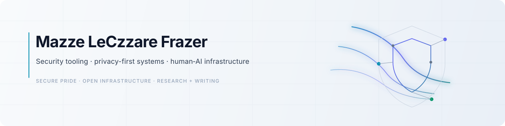

  <picture>
    <source media="(prefers-color-scheme: dark)" srcset="./assets/banner-dark.svg">
    <source media="(prefers-color-scheme: light)" srcset="./assets/banner-light.svg">
    
  </picture>

---

## Selected Work

| Project | What it does | Why it matters |
|---|---|---|
| [**Secure Pride**](https://github.com/mazze93/Secure-Pride) | Privacy posture checks and device hardening for macOS, iOS, and Linux | Makes practical security usable for vulnerable orgs and independent builders |
| [**Context Synapse**](https://github.com/mazze93/context-synapse) | Experimental engine for human–AI context negotiation | Explores conversational state, agent memory, and alignment between human and machine systems |

---

## Focus

- Security tooling that reduces real-world risk for people who aren't security engineers
- Privacy-preserving infrastructure for builders and vulnerable organizations
- Human–AI systems that are legible, calm, and operationally sound
- Calm, accessible software design without sacrificing correctness

---

## Writing + Research

Essays, research notes, and technical explorations on privacy infrastructure, human–AI collaboration, and open source systems thinking.

→ [mazzeleczzare.com](https://mazzeleczzare.com) · [ORCID 0009-0005-9661-4780](https://orcid.org/0009-0005-9661-4780)

---

## Build philosophy

Software should be secure, humane, understandable, and accessible to people who aren't security engineers. That's the constraint every project here is built against.

---

## Working together

Open to collaboration on privacy tooling, secure infrastructure, and human–AI systems. Open an issue or reach out directly.
